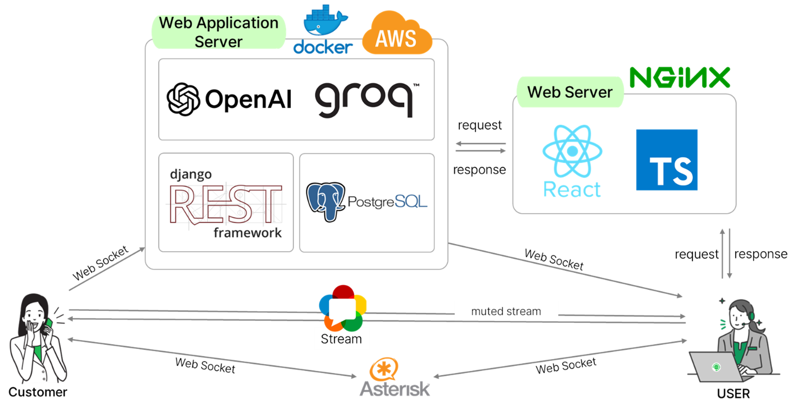

# VOSS - Voice of Smart System

## 

## 프로젝트 소개

VOSS(Voice of Smart System)는 AI를 활용해 실시간 감정 분석과 음성 변환을 통해 **악성 민원으로부터 상담사를 보호**하고, **업무 효율을 높이는 전화 민원 대응 시스템**입니다.

---

## 프로젝트 개요

- **참여 과정**: KT 에이블스쿨 5기 빅프로젝트
- **진행 기간**: 2024.06.17 - 2024.07.30
- **주요 기술**: React, TailwindCSS, Django, WebRTC, GPT-4o, Google TTS 등
- **기획 주제**: 실시간 음성 감정 분류와 음성 변환 기술을 활용한 악성 민원 대응 시스템 개발

---

## 문제 배경

- 콜센터에서 빈번히 발생하는 악성 민원으로 인해, **상담사의 스트레스와 이직률이 급증**하고 있음
- 기존 민원 보호 시스템은 대응까지 시간이 걸리고, 실제로 보호가 체감되지 않음
- 실시간 감정 분석 및 즉각적인 조치를 통해 **상담사의 심리적 부담을 줄이는 시스템의 필요성 대두**

---

## 서비스 개요

본 시스템은 다음과 같은 기능을 통해 상담사를 지원합니다:

- **실시간 감정 분석**으로 악성 민원 여부 판단
- **음성 변환**을 통해 민원인의 억양을 조절하여 상담사의 심리적 피로 완화
- **상담 내용 요약 및 키워드 시각화**를 통해 민원 처리 흐름을 체계적으로 관리

---

## 서비스 아키텍쳐

## 서비스 개발 및 기여

> **역할: 프론트엔드 기능 구현과 백엔드 초기 세팅과 API구현 담당**

- **UI/UX 설계**
- Figma를 사용해 사용자 중심의 화면 흐름 구성
- 상담사와 관리자를 구분하여 인터랙션 설계

- **Auth 기능 구현**
- JWT 기반 **회원가입/로그인 페이지** 구현
- 인증 상태에 따른 라우팅 및 토큰 유지 처리

- **상담 기록 게시판 개발**
- 감정 분석 결과, 상담 요약, 키워드를 보기 쉽게 시각화
- 날짜/키워드별 필터 기능으로 상담 기록을 효율적으로 탐색 가능
- 상태 값에 따른 UI 변화 처리 및 반응형 설계

- **Django API 설계**
- docker 기반 환경 구성 및 django 프로젝트 초기 세팅 진행
- 기본 API (회원가입,로그인,게시판CRUD,admin 등) 개발 담당

---

## 기대 효과

- ✅ **상담사 스트레스 완화**: 악성 민원 발생 시 감정 분석 및 억양 조절을 통해 감정적 피로 감소
- ✅ **민원 관리 효율 향상**: 상담 내용 요약 및 키워드 대시보드 제공
- ✅ **고객 응대 최적화**: 상담 내역 기반 맞춤형 대응 가능

---

## 팀 구성 및 역할

| 이름   | 역할               |
| ------ | ------------------ |
| 최영진 | 팀장, AI모델       |
| 장도진 | 백엔드, 프론트엔드 |
| 장연지 | 프론트엔드         |
| 박정재 | AI모델             |
| 이솔   | 프론트엔드         |
| 신예빈 | AI모델, 백엔드     |

---

## 회고

이 프로젝트를 통해 실제 사용자의 고충을 기술로 해결하는 경험을 할 수 있었고, 특히 사용자 경험을 고려한 **정보 시각화와 인터페이스 구현**의 중요성을 다시금 느꼈습니다.  
비전문 영역(AI/백엔드)과의 협업을 통해 **서비스 전체 구조를 이해하고 조율하는 능력** 또한 성장할 수 있는 소중한 기회였습니다.
